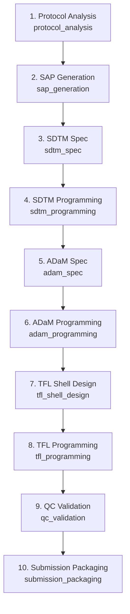

<!-- AUTO-GENERATED: run `python -m scripts.content.generate_workflow_map`. -->

# Clinical Workflow 十阶段地图

> [!important] 控制权威
> Engine Pipeline Contract 决定阶段 ID、固定顺序与依赖；本页只是 Obsidian 可视化投影。
> 阶段的执行方法由链接的 Wiki Playbook 解释，当前 Study 决策仍保存在 Study 工作区。

## 固定管线

## 阶段知识入口

| # | Stage ID | 固定阶段 | Wiki Playbook |
|---:|----------|----------|---------------|
| 1 | `protocol_analysis` | Protocol Analysis | [[30_Workflows/Stages/Protocol Analysis|Protocol 分析基线工作手册]] |
| 2 | `sap_generation` | SAP Generation | [[30_Workflows/Stages/SAP Generation|SAP 生成基线工作手册]] |
| 3 | `sdtm_spec` | SDTM Spec | [[30_Workflows/Stages/SDTM Spec Baseline|SDTM 规范构建基线工作手册]] |
| 4 | `sdtm_programming` | SDTM Programming | [[30_Workflows/Stages/SDTM Programming|SDTM 编程基线工作手册]] |
| 5 | `adam_spec` | ADaM Spec | [[30_Workflows/Stages/ADaM Spec|ADaM 规范构建基线工作手册]] |
| 6 | `adam_programming` | ADaM Programming | [[30_Workflows/Stages/ADaM Programming|ADaM 编程基线工作手册]] |
| 7 | `tfl_shell_design` | TFL Shell Design | [[30_Workflows/Stages/TFL Shell Design|TFL Shell 设计基线工作手册]] |
| 8 | `tfl_programming` | TFL Programming | [[30_Workflows/Stages/TFL Programming|TFL 编程基线工作手册]] |
| 9 | `qc_validation` | QC Validation | [[30_Workflows/Stages/QC Validation|QC 验证基线工作手册]] |
| 10 | `submission_packaging` | Submission Packaging | [[30_Workflows/Stages/Submission Packaging|提交包构建基线工作手册]] |

## 相关导航

- [[10_MOC/Workflow-MOC|十阶段工作流导航]]
- [[10_MOC/Stage-Traceability-MOC|十阶段纵向追溯导航]]
- [[HOME|返回首页]]
